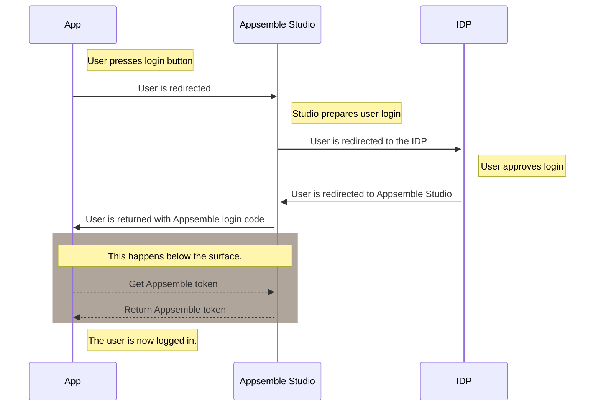

# SAML2.0

Appsemble supports login to apps using SAML2.0 identity providers (IDP). This allows users to login
using Single Sign On (SSO), for example using Microsoft Azure AD. In this case Appsemble Studio
serves as the SAML2.0 service provider (SP).

## Flows

Users may try to access an application from one of the following flows:

- Service Provider (SP) flow. From a browser, the user attempts to go directly to the web resource
  without authenticating. The user is redirected to the IDP to authenticate. Once authenticated the
  user is redirected back to the web resource. **This flow is supported in Appsemble**
- Identity provider (IDP) flow. The user launches applications to the service provider (SP)
  resource. In Enterprise Application Access (EAA), this happens from the EAA Login Portal after the
  user authenticates them. When the user clicks on an application icon, a SAML assertion
  (authentication) is sent over to the SP Assertion Consumer Service (ACS). The user is signed into
  the service and does not need to enter their credentials again. **This flow is currently
  unsupported in Appsemble**

## Limitations

Currently, the SSO settings need to be repeated for each app. There’s no organization wide
configuration option.

## Configuration

There’s a certain order to configuring the Appsemble (SP) side of things and the client side (IDP).

### 1. Appsemble side

Configuration options for SAML2.0 can be found in Appsemble studio, on the _Secrets_ page of the
app. Look for the _SAML_ segment and choose to **+ Add new secret**.

The following properties can be filled in without restrictions. Use values that best match your app.

- **Name**: The name that will be displayed on the login button.
- **Icon**: A Font Awesome icon. A list of available icons can be found
  [here](https://fontawesome.com/icons?m=free)
- **Login endpoint**: It’s a required field, but you might not yet have received the proper value
  from the IDP. If that’s the case, temporarily fill in: `https://example.com`

Press **Save secret** to generate the secrets we need to continue. You get back to the _Secrets_
page. Now click the created SAML secret to get back to the editing dialog. Scroll down and copy the
following values and send them to the IDP.

- Attribute consume service endpoint (Looking something like:
  `https://appsemble.app/api/apps/<app id>/saml/<saml id>/acs`, URL is not accessible)
- Service provider entity ID (Looking like:
  `https://appsemble.app/api/apps/<app id>/saml/<saml id>/metadata.xml`, URL should be accessible).

### 2. IDP Side

The following instructions are written for the Microsoft Azure portal. Instructions and terms might
differ a bit when using another SSO provider.

The IDP should create a SAML-based Sign-on for an enterprise application.

Basic SAML configuration parameters to fill in:

- Identifier (Entity ID): this should look like:
  `https://appsemble.app/api/apps/<app id>/saml/<saml id>/metadata.xml`
- Reply URL (Assertion Consumer Service URL): should look like:
  `https://appsemble.app/api/apps/<app id>/saml/<saml id>/acs`

The following values should be retrieved from the _SAML Certificates_ section and sent back to
Appsemble:

- App federation metadata URL: this should look like:
  `https://login.microsoftonline.com/<guid>/federationmetadata/2007-06/federationmetadata.xml?appid=<another guid>`
- SAML sign-on endpoint. Looking like: `https://login.microsoftonline.com/<guid>/saml2`.

### 3. Appsemble side (again)

In the studio, edit the existing SAML secret once more. Now fill in:

- **Login endpoint**: This is the URL where users will be redirected to perform a login. Typically
  this is a URL that ends on `/saml/login` or in case of Azure
  `https://login.microsoftonline.com/<guid>/saml2`.
- **Identity provider entity ID**: This is the URL that serves the SAML2.0 metadata. Typically this
  is a URL that ends on `/saml/metadata.xml` or in the case of Azure
  `https://login.microsoftonline.com/<guid>/federationmetadata/2007-06/federationmetadata.xml?appid=<another guid>`.
  Alternatively the identity provider certificate may be provided.
- **Identity provider certificate**: This is the certificate for the SAML2.0 formatted as PEM. In
  the case of Azure, this field remains empty.

## Login flow

The following diagram describes the login flow to Appsemble apps using third party SAML2.0
providers.

Note that user accounts are always linked to Appsemble. This allows for assigning user roles within
an app or organization. The step in the login flow where the user gets redirected to the Appsemble
Studio should be fast enough for users to not notice this technical detail.
