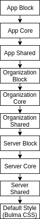

# Theming Apps

By default Appsemble provides a default style based on the [Bulma CSS framework](bulma). While this
is completely functional for end users, developers may be interested in further spicing up their
applications by applying their own style and branding.

To support this, Appsemble supports custom styling using a hierarchical model by allowing developers
to upload CSS which gets injected during the runtime of an application. Stylesheets can be uploaded
at **three different levels** and can be injected at **three different points** within applications.

## Hierarchy

 <!-- XXX: This should probably be oriented horizontally -->

Applications can be styled at a **server** level, **organization** level as well as the
**app-specific** level.  
Within each level, styling can be further specified for **core** modules, **block** modules and
**shared** modules.

### Levels

**Server**-level styling gets applied to every application hosted on the Appsemble server. This is
useful for quickly applying style changes without having to re-deploy the server.

**Organization**-level styling gets applied to every application that belongs to a specific
organization. This is useful for applying unified styling across every application within an
organization, such as for supplying basic colour themes and icons.

**App**-level styling gets applied to one specific application. This is primarily used for any
styling that is directly related to one specific application without influencing any other
applications. App-level styling overrides any styling applied at organization and server levels.

### Modules

**Core**-module styling gets applied to any part of an Appsemble application not related to a block,
such as the navigation bar, side menu, login view, message toasts, et cetera. The styling applied to
the core modules _do not_ get applied to blocks.

**Block**-module styling gets applied to a specific block.

## Applying themes for an application

## Applying themes for an organization

## Applything themes for server

[bulma]: https://bulma.io/
