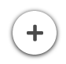

# Action Button

## Introduction

A simple button that performs an action when clicked.

It can be used to trigger actions such as redirecting to other pages. By default it displays in the
lower-right corner, allowing for easy access on mobile devices.

## Actions

| Action | Required | Description                                            |
| ------ | -------- | ------------------------------------------------------ |
| click  | true     | Action that gets dispatched when the button is clicked |

## Images

