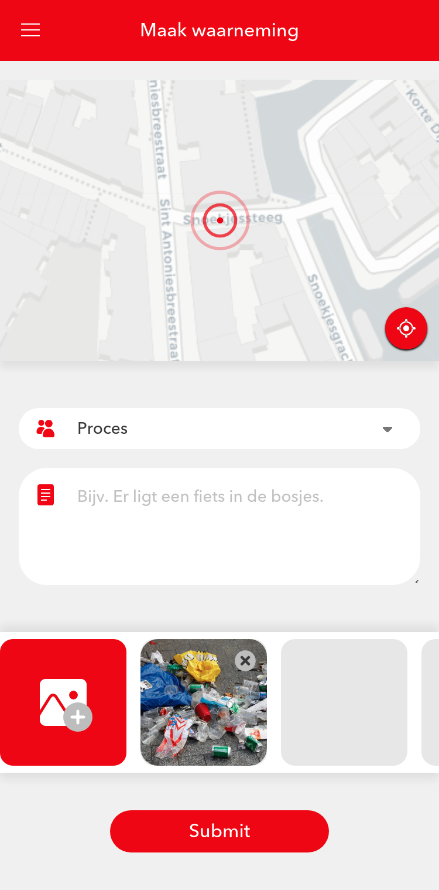

# Form

## Introduction

A block used for inputting and submitting sets of data.

## Actions

| Action        | Required | Description                                                               |
| ------------- | -------- | ------------------------------------------------------------------------- |
| submit        | true     | Action that gets dispatched when the form is submitted                    |
| submitsuccess | false    | Action that gets dispatched when the form has been submitted successfully |

## Parameters

| Parameter     | Default      | Description                                                             |
| ------------- | ------------ | ----------------------------------------------------------------------- |
| fields        |              | A list of objects describing each field that can be entered in the form |
| field[].name  |              | The name used when storing this field                                   |
| field[].label | field[].name | User-facing label describing the field                                  |
| field[].type  | string       | The type of the data                                                    |

#### Field types

Based on the type of field, additional parameters are available.

##### string (default)

A regular text entry field

| Parameter           | Description                                                                                 |
| ------------------- | ------------------------------------------------------------------------------------------- |
| field[].placeholder | Placeholder value displayed when field is empty                                             |
| field[].multiline   | Boolean value representing whether to use a multline text field or a single line text field |

##### geocoordinates

A location picker used to select a location.

##### file

An input field used to upload files.

| Parameter        | Description                                                                                                                              |
| ---------------- | ---------------------------------------------------------------------------------------------------------------------------------------- |
| field[].accept   | A list of accepted [MIME-types](https://developer.mozilla.org/en-US/docs/Web/HTTP/Basics_of_HTTP/MIME_types/Complete_list_of_MIME_types) |
| field[].repeated | Boolean value representing whether to accept one file or multiple files                                                                  |

##### enum

A dropdown list containing a list of predetermined values.

| Parameter     | Description                                          |
| ------------- | ---------------------------------------------------- |
| field[].value | The value and name of the field that can be selected |

## Images

