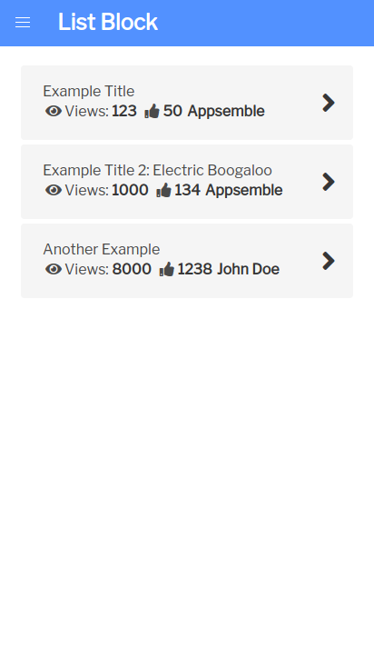

# List

## Introduction

A block that can be used to display larger sets of data.

## Actions

| Action  | Required | Description                                   |
| ------- | -------- | --------------------------------------------- |
| onClick | false    | Action that is called when clicking on a row. |

## Parameters

| Parameter      | Default       | Description                                                                |
| -------------- | ------------- | -------------------------------------------------------------------------- |
| fields         |               | A list of fields to display based on the name from the schema              |
| fields[].name  |               | The name of the property of the data to fetch from. Supports dot notation. |
| fields[].label | fields[].name | The label that is presented to the user                                    |

## Events

### Listen Events

| Event | Description                                                                                                                   |
| ----- | ----------------------------------------------------------------------------------------------------------------------------- |
| data  | The event that is triggered when data is received. Compatible data that is received will be displayed. Must be a set of data. |

## Images

