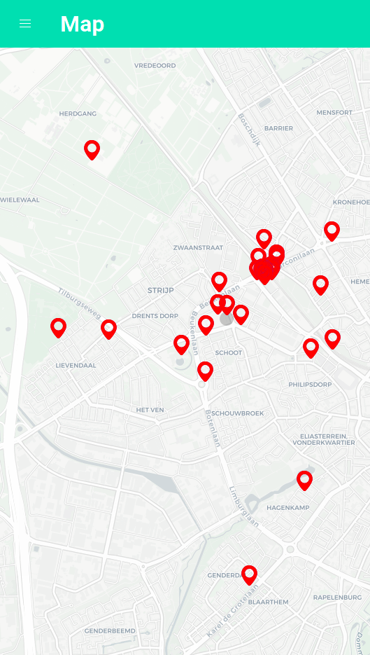

# Map

## Introduction

A block that displays a map powered by [OpenStreetMap](https://www.openstreetmap.org/about) that can
be used to display and interact with markers.

Markers can be loaded from external sources or from Appsemble’s resource API.

Markers that are too close to each other to be visually distinguishable will be clustered by
default.

## Actions

| Action        | Required | Description                                           |
| ------------- | -------- | ----------------------------------------------------- |
| onMarkerClick | false    | Action that gets dispatched when a marker is clicked. |

## Parameters

| Parameter         | Default        | Description                                                                                                                    |
| ----------------- | -------------- | ------------------------------------------------------------------------------------------------------------------------------ |
| longitude         | longitude      | The name of the field used to retrieve the longitude                                                                           |
| latitude          | latitude       | The name of the field used to retrieve the latitude                                                                            |
| disableClustering | false          | Whether clustering should be disabled or not.                                                                                  |
| maxClusterRadius  | 80             | The maximum radius that a cluster will cover from the central marker (in pixels). Decreasing will make more, smaller clusters. |
| icons             |                | Custom icon configuration.                                                                                                     |
| icons.icon        | map-marker-alt | A Font Awesome icon name to use.                                                                                               |
| icons.asset       | automatic      | The id of an asset to use.                                                                                                     |
| icons.anchor      | `[0, 0]`       | The anchor X and Y offset used for positioning the image.                                                                      |
| icons.size        | 28             | The height of marker icons in pixels.                                                                                          |
| icons.activeRatio | 28             | Enlarge an active marker with this ratio.                                                                                      |

## Events

### Emit Events

| Event | Description                                                                                                                                                                                               |
| ----- | --------------------------------------------------------------------------------------------------------------------------------------------------------------------------------------------------------- |
| move  | Event that gets emitted when moving the map around. Will apply [OData filters](https://www.odata.org/) to limit the range of items fetched. This will be skipped if the `move` emit event is not defined. |

### Listen Events

| Event | Description                                                                                                                   |
| ----- | ----------------------------------------------------------------------------------------------------------------------------- |
| data  | The event that is triggered when data is received. Compatible data that is received will be displayed. Must be a set of data. |

## Images

