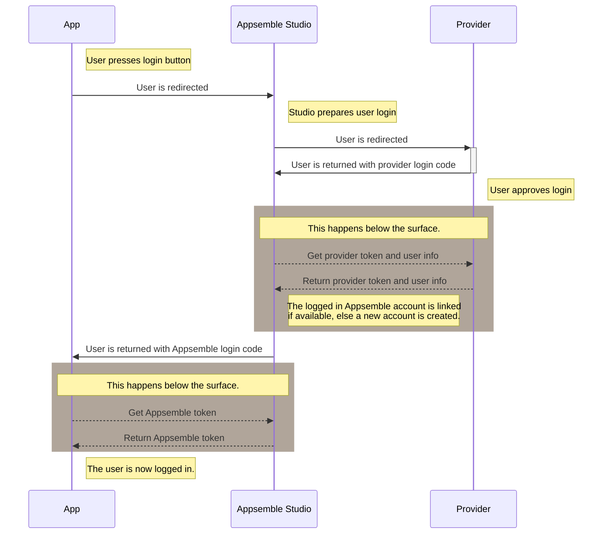

# OAuth2

Appsemble supports login using third party OAuth2 providers. Appsemble uses the authorization code
flow, which is the most commonly supported and most secure flow. Examples of supporting providers
are Facebook, Google, GitHub, GitLab, and Microsoft, but your organization may be a compliant OAuth2
provider as well.

## OpenID

OpenID is an extension on the OAuth2 authorization code flow, which allows access to certain user
related properties in a standardized way. Appsemble uses some of its functionalities.

- **ID token**: ID tokens represent user information in a standardized way. Appsemble tries to
  extract user information from this, if they are present.
- **User info endpoint**: The user information endpoint is an alternative way to get user
  information. Appsemble tries to fetch user information from here if the ID token isn’t present or
  lacks certain information.
- **Scopes**: The default scope is set to `email`, `openid`, and `profile`. This matches the
  required scope to perform a login as defined by OpenID specification.

## Configuration

The following properties can be filled in without restrictions. Use values that best match your app.

- **Name**: The name that will be displayed on the login button.
- **Icon**: A Font Awesome icon. A list of available icons can be found
  [here](https://fontawesome.com/icons?m=free)

The following values depend on the OAuth2 provider that is being configured.

- **Redirect URL**: The user will be redirected to this URL to allow, where they allow Appsemble to
  log them in. Typically this value is documented in the documentation for the OAuth2 provider.
- **Token URL**: This is where Appsemble requests access tokens, which are then used to communicate
  with the third party servers. Typically this value is documented in the documentation for the
  OAuth2 provider.
- **User info URL**: The user info URL is the URL from which user information is fetched from. See
  [OpenID](#OpenID) for more information.
- **Client ID**: This ID identifies Appsemble as a client for the third party system. It should be
  generated by the authorization provider. Sometimes this is also called **app ID**.
- **Client Secret**: This proves the authenticity of Appsemble when it authenticates itself. This is
  typically generated together with the client ID. Sometimes this is also called **app secret**.
- **Scope**: The scope represents the permissions Appsemble requires to login the user. For OpenID
  compliant providers, just leave the defaults.

When registering Appsemble as a client, make sure to set the redirect URI (often called callback
URL) to `/callback` on in Appsemble Studio. For example if Appsemble Studio is running on
<https://appsemble.app>, the redirect URI should be set to <https://appsemble.app/callback>.

If this has been configured, the login button for your app will show a new login button for this
provider.

## Login flow

The following diagram describes the login flow to Appsemble apps using third party OAuth2 providers.

Note that user accounts are always linked to Appsemble. This allows for assigning user roles within
an app or organization. The step in the login flow where the user gets redirected to the Appsemble
Studio should be fast enough for users to not notice this technical detail.
