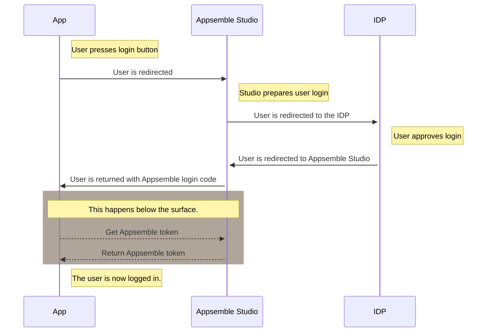

# App Member

The users of an app are called `App Members`, the Appsemble platform has users that can build apps,
which can also be connected to App Members. Cr

- AppMember.ts
- AppOAuth2Authorization.ts
- AppOAuth2Secret.ts
- AppSamlAuthorization.ts
- AppSamlSecret.ts
- AppServiceSecret.ts
- EmailAuthorization.ts
- OAuth2AuthorizationCode.ts
- OAuth2ClientCredentials.ts
- OAuthAuthorization.ts
- ResetPasswordToken.ts
- SamlLoginRequest.ts
- GroupMember.ts
- Group.ts
- Theme.ts
- User.ts

