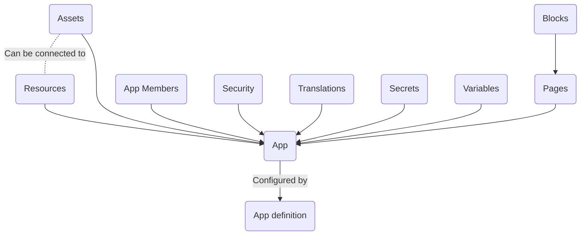

# App

Apps are configured using an "App definition". This is the file that you access in the Editor page
of your app. The file is formatted using [YAML](../guides/yaml-syntax.mdx).

An app is a collection of different systems combined into one whole app. Each system extends the
default capabilites of an app with new features like security, a database or translations. Most of
these are configured directly from within the app definition.

For a basic tutorial on how to use some of these systems to create a small app, check out the
[Basic app guide](../guides/basic-app.md).

## Users

### Guests

Guests are users of apps, who are interacting with it without an account. Their permissions can be
set by using the guest property in the app definition file. For more information check out
[security](./security.md).

### Members

App members are users of an apps, who have an account in it. Apps with a basic security definition
require you to be registered and logged in into the app. App members can perform various tasks
depending on the roles assigned to them and the app permissions that these roles have.

App members are configured by creating a [security definition](./security.md#security-definition).

If you have enough organization permissions, you can access `AppMembers` of your app in the studio
on the `AppMember` page in the studio and even export the data as
[CSV](https://en.wikipedia.org/wiki/Comma-separated_values) file.

You can view which apps are connected to your Appsemble account at [Connected Apps](/settings/apps)
page.

## Settings

In the settings page of the app you can change some high level properties to change how the app
works. These options range from enabling external analytics checkers to deleting the app.

- **Icon:** Change the icon of the app (See [app-icons](../guides/app-icons.md) for more
  information).
- **Visibility:** Who can see the app.
- **Show app definition:** Whether everyone can see the app definition in the store page or not.
- **Path:** The path used to access the app `https://{path}.appsemble.appsemble.app`.
- **Domain name:** The domain on which the app is available (See [DNS](../guides/dns.md) for more
  information).
- **Email name:** The name displayed as sender for emails sent from this app.
- **Google Analytics ID:** Google analytics will be applied to your app. (See
  [App analytics](../guides/analytics.md) for more information).
- **Sentry DSN & Sentry Environment:** Sentry monitoring and error tracking will be applied to your
  app. For more information on what to put in here, see https://sentry.io/welcome/.

There are also two buttons at the bottom:

- **Lock app:** Prevents the app from being updated.
- **Delete app:** Deletes the app entirely.

## Variables & Secrets

There are some values that you are better off not sharing with other people. Things like API keys
and secrets can be easily abused if they fall into the wrong hands. To prevent this from happening,
we have the `Variables`, and `Secrets` menus. These allow you to define keys and set their values in
a secure environment.

Secrets also allow you to connect with third party services for authentication or user provisioning,
provide your own SSL certificate or define email settings.

For further information, check the [documentation](config.md).

## Transfer

Apps can be transferred out of the system as a zip file using the export feature. This can either be
done on the app's store page, or using the [CLI](../packages/cli#apps). You can import an archived
app again in the [app store](/apps#import), or using the CLI `publish` command.

For more details, see the [documentation](../guides/basic-app.md#export-import).

## Table of contents

- [Assets](assets.md)
- [Blocks](blocks.md)
- [Config](config.md)
- [Resources](resources.md)
- [Security](security.md)
- [Groups](groups.md)
- [Styling](styling.md)
- [Translating](translating.md)
