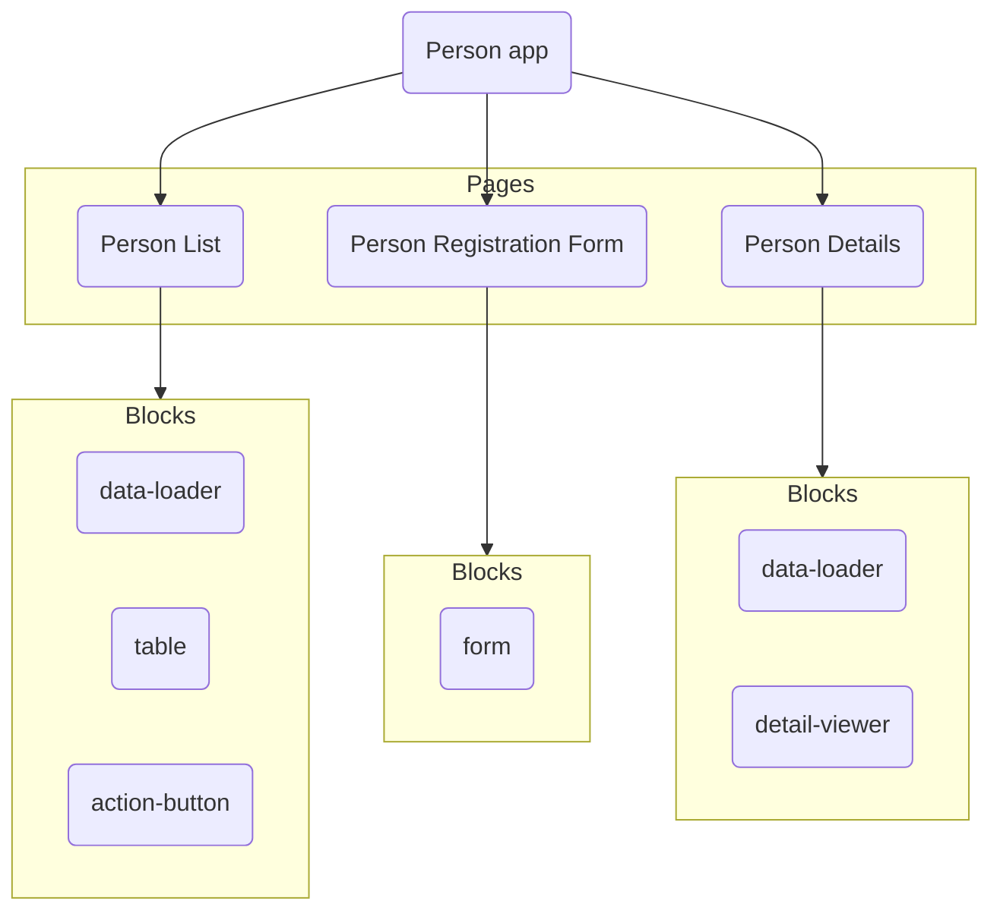

# Page

An app is made up of one or more pages, which contain blocks that make up the content of the actual
app. There are more options that you can use for a page definition to further customise the user's
experience, however.

As an example, here is a diagram of how the [Person app](https://appsemble.app/en/apps/3/person) is
structured:



**The following properties are required**:

- **name**: The name of the page. This shows in the navbar, the URL and can be used by other actions
  to link to this page. The name of the page in the navbar can be changed with the `navTitle`
  property, however.
- **blocks**: Each page requires an array of blocks to be defined, with a minimum of 1 block. The
  order of the blocks defined in the page definition determine in which order the blocks get
  rendered on the page.

This is esentially a summary of the
[page definition reference](../reference/app.mdx#-page-definition). If any of this does not make
sense, you can look at the reference for more information.

## Page type

Depending on your application, you might want to change what kind of page you have. If you'd like
nested or dynamic pages, you'll need to look outside of the standard page definition.

There are currently 3 different types of pages:

- **Tabs page**: Define sub-pages for a page as different tabs.
- **Flow page**: Define a set of sub-pages in a certain order that the user must go through
- **Loop page**: Flow page that allow you to load in data to dynamically generate pages

These are more defined [here](../guides/page-types.md).

## Navigation

There are a couple of options available to change how the page is shown in the navigation menus:

- **hideName**: Whether or not the page name should be displayed in the **app bar**.
- **navTitle**: The name of the page in the navigation menu
- **hideNavTitle**: Whether or not the page should be displayed in navigational menus. False by
  default
- **navigation**: The type of navigation menu displayed on the page. Overrides the app default. This
  can be `left-menu`, `bottom` or `hidden`.

## Security

You can set which role(s) can access a certain page by using the `roles` property. This property is
an array of all the role names that are allowed on the page. If the user doesn't have the role, they
don't even see the page in the navigation menu.

If you specify the `roles` property as an empty array, it only allows people who are logged into the
app onto the page. If the user isn't logged in, it prompts them to do so or create an account.

In order for this to function properly, make sure to set up a
[security definition](./security.md#security-definition).

## Page parameters

If your page is made to display a single resource, you can define `page parameters`. This is a list
of strings that can be used to identify a specific resource. The list is appended to the end of the
page's URL, which can then later be used by actions to get that certain resource.

For example, if you want to have a page for displaying the details of a certain customer you simply
want to pass their ID to the page and have it fetch the details automatically. You can do this

```yaml copy
pages:
  - name: Person details
    parameters:
      - id
```

In the live app, this becomes: `https://{app path}/{language}/person-details/{id}`

Some actions use this parameter for their logic. The most common one is the
[`resource.get`](../actions/resources.mdx#resourceget) action, which uses the parameter to get a
resource matching it. The following code automatically uses the ID from the parameter to fetch the
resource:

```yaml copy
type: resource.get
resource: person
```

Result:

```json
{
  "id": 83069,
  "firstName": "Loretta"
}
```

The [Person app](https://appsemble.app/en/apps/3/person) uses this mechanic for their functionality.
If you'd like to see this work in real time or mess around with it, feel free to clone the app and
check it out.

> **Note:** Each parameter in the list gets appended to the end of the URL with a `/` in front of
> it, in the order of which they are defined. If you were to add more parameters like a department
> and manager id, this would turn into: `.../{id}/{department}/{managerId}`. This can help in
> reducing the amount of code you need to write.

## Theming

You can use the page's name or index to apply specific styling to the page. This can be used as a
path.

If you want to set the background color of an entire page:

```css
[data-path='pages.example-page'] {
  background-color: red;
}
```

Or, you can use the path to target a specific block you want to change the styling of:

```css
[data-path-index='pages.0'] [data-block='@appsemble/list'] {
  background-color: blue;
}
```

To learn more, see [Styling](../guides/custom-css.md#applying-themes-to-specific-blocks-or-pages).
