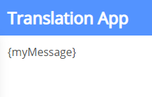
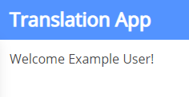

# Translating

## Table of Contents

- [Introduction](#introduction)
- [Appsemble Core and Blocks](#appsemble-core-and-blocks)
- [Custom messages](#custom-messages)
- [Translating screenshots](#translating-screenshots)
- [Using the translations page](#using-the-translations-page)
- [Translating using the Appsemble CLI](#translating-using-the-appsemble-cli)

## Introduction

Just like how the Appsemble Studio is available in multiple languages, it is possible to do the same
in individual apps. This page covers the different options that are available for translating and
localizing apps.

By default, every app is assumed to support English and will also default to this language. This can
be overwritten by defining the `defaultLanguage` property with the value being a two-letter language
code.

Every translatable part of Appsemble is called a “message” and will be referred to as such in this
document. Internally it uses the _[ICU message syntax][icu]_ which is one of the available standards
that is commonly used for internationalization. This allows for support of arguments, pluralization,
date formatting, number formatting and more.

## Appsemble Core and Blocks

Appsemble provides default translations for the core parts of an app, the part that is provided by
Appsemble itself without any further configuration. Generally speaking, this includes messages such
as error messages, menu options and block messages. The languages that are maintained by the
Appsemble group are English and Dutch, with support for crowd-sourced translations via Weblate which
can be found [here](https://hosted.weblate.org/projects/appsemble/#languages).

It is possible to provide translations for the core messages or overwrite existing ones using the
translation methods provided by Appsemble. If a set of translations is used for multiple apps, it is
worth considering contributing these for other users to use via
[Weblate](https://hosted.weblate.org/projects/appsemble/appsemble).

[](https://hosted.weblate.org/engage/appsemble/)

## Custom messages

It is possible to provide custom messages within an app. This can be done by using the
[`translate`](../remappers/data.mdx#translate) or
[`string.format`](../remappers/strings.mdx#stringformat) remappers. The former is typically used for
simple translations that don’t use any arguments, whereas the latter can be used for more control
over arguments that get passed in (for usage with the [ICU syntax][icu]), as well as optionally
defining a default or fallback translation.

Let’s look at a simple example of what this looks like in an app.

```yaml validate blocks-snippet
blocks:
  - type: markdown
    version: 0.33.7
    parameters:
      content:
        translate: myMessage
```

By default this will result in the following text being displayed: `{myMessage}`

This is because `myMessage` does not have any messages assigned to it in the current language. If a
message with the id `myMessage` is defined for the current language, it would simply display the
message’s content.

Alternatively using `string.format`:

```yaml validate blocks-snippet
blocks:
  - type: markdown
    version: 0.33.7
    parameters:
      content:
        string.format:
          messageId: myMessage
          values:
            name:
              user: name
```



By default, like before, will display `{myMessage}` if the message is not defined for the current
language. With a message defined like this, however, it would then be possible to define a message
like so:

For English: `Welcome {name}!` For Dutch: `Welkom {name}!`

If the user is logged in and has their name set in their Appsemble account, it will display the
message, as well as the name of the user assuming they are logged in:



With the above example if the user is not logged in it will display a blank spot in the spot where
the `{name}` value is set. This could be solved by using an
[if remapper](../remappers/conditionals.mdx#if).

## Translating screenshots

Appsemble provides a mechanism for app screenshots by language. Read more about it
[here](../guides/screenshots.md)

## Using the translations page

To start translating your app, go to the translations page found in the navigation menu of your app
within the Appsemble Studio. On this page you can add and remove languages by clicking on the +
and - buttons.

These messages are split up in different categories depending on where the translations originate
from.

The categories are:

- Custom messages: These are all the IDs of messages defined by `translate` and `string.format`
  messages.
- App messages: These are the messages that provide translations for various metadata of the app,
  such as its name, the description, the names of its pages and overrides for block messages on a
  per-page basis.
- Block messages: These are the messages used by blocks. If the currently selected language is
  supported by Appsemble these will be filled in by default, otherwise you might have to provide
  your own translations if the English fallback is undesirable. A block may appear multiple times in
  this list due to the fact that each version can potentially have a completely different set of
  message IDs and translations.
- Core messages: These are all the messages Appsemble uses when displaying the app. These range from
  the messages used for logging in and out, errors that may show up and so forth.

After filling in the translations, make sure to click the `Save` button at the bottom of the page.


## Translating using the Appsemble CLI

An alternative method for providing an app with translations is to use the Appsemble CLI. This is
what the Appsemble group uses to keep the translations from Weblate, as well as the English and
Dutch translations up to date.

This section assumes that the entire app structure is defined locally.

By adding a directory called `i18n` you can start adding support for languages by defining `json` or
`yaml` files named after the language code of the language you want to support. For example:
`fr.json` for French translations.

```
my-app/
├── app-definition.yaml
└── i18n/
    ├── en.json
    ├── nl.json
    └── fr.json
```

The format used for these translation files is similar to the format shown on the translations page.

```json
{
  "messageId": {
    "myMessage": "Welcome {name}!"
  },
  "app": {
    "name": "The app’s name",
    "description": "The app’s description",
    "pages.example-page": "The name of the first page",
    "pages.example-page.blocks.1.example": "The message with ID ‘example’ from the second block on the first page"
  },
  "blocks": {
    "@appsemble/form": {
      "0.33.7": {
        "submit": "An example override of the submit message in the form block."
      }
    }
  },
  "core": {
    "app.src.components.OpenIDLogin.loginWith": "An example of overriding the message of the login button. The variable {name} can be used here."
  }
}
```

Updating the app’s messages is done automatically when updating the app through the Appsemble CLI.
The messages are validated and the CLI should give helpful clues as to what needs to be changed in
order to resolve any potential mistakes that it finds.

```sh
npx appsemble app update ./my-app
```

[icu]: https://formatjs.io/docs/core-concepts/icu-syntax/
