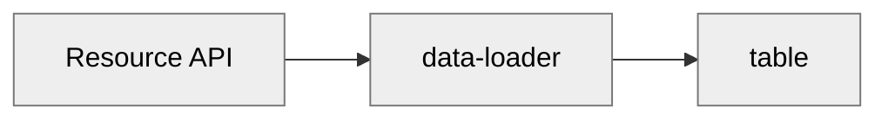

# Basic app

Each app has a name, description, and a default page. Notice that the name and description have the
value that was entered in the _“Create new app”_ dialog.

## Table of Contents

- [Empty app](#empty-app)
- [Adding a resource](#adding-a-resource)
- [Displaying data](#displaying-data)
- [Creating data](#creating-data)
- [Detail view](#detail-view)
- [Export Import](#export-import)
- [Further reading](#further-reading)

## Empty app

The newly created app has two pages. On each page an
[`action-button`](/blocks/@appsemble/action-button) block is rendered.

The icon on the button is specified in the block parameters. Since each block type has different
functionalities, they also accept different types of parameters.

Each block type may also call specific types of actions. In case of the `action-button`, the button
may be clicked. This is why it has an `onClick` event. When the button on _“Example Page A”_ is
clicked, a `link` action is called. This will link the user to _“Example Page B”_. Vice-versa,
_“Example Page B”_ has a button that links to _“Example Page A”_.

## Adding a resource

Resources allow apps to store data in the Appsemble resource API or to map resources to somewhat
compliant third party APIs. This tutorial will focus on usage of resources with Appsemble’s own
resource API.

Add the following to the app definition at the root of the YAML:

```yaml copy validate resources-snippet
resources:
  person:
    schema:
      type: object
      additionalProperties: false # Custom properties are disallowed to ensure the shape of each person resource is fixed.
      required:
        - firstName
        - lastName
        - email
      properties:
        firstName:
          type: string
          maxLength: 80
        lastName:
          type: string
          maxLength: 80
        email:
          type: string
          format: email
        description:
          type: string
          maxLength: 500
```

This may look daunting at first, but it’s not that complicated when given a closer look. This
specified a resource named `person`. Resources have a `schema` property. This `schema` property is a
[JSON schema](https://json-schema.org/draft/2019-09/json-schema-validation.html). Such schemes allow
complex structures, but typically this isn’t needed for resources. The person schema describes an
object which has the properties `firstName`, `lastName`, `email`, and `description`. `firstName` and
`lastName` shouldn’t be too long, whereas `email` should be a valid email address. For example, this
could represent the following data structure:

```json
{
  "firstName": "John",
  "lastName": "Smith",
  "email": "john.smith@example.com",
  "description": "This is the best smith in town."
}
```

The schema is used as a safety net for invalid data, but also for representation in some places.

When the app is published with the `resources` property, a new “Resources” menu item appears in the
side menu. This way resources can be managed in a generic way from within
[Appsemble studio](../studio/index.md) in an administrator-like fashion.

## Displaying data

Resources exist for use in the app. A simple way to display data is to add a `table` block. A table
block can display data in an orderly manner in a table.

Let’s replace _“Example Page A”_ and _“Example Page B”_ with a single page, named _“People”_.

```yaml copy
pages:
  - name: People
    blocks:
      - type: table
        version: 0.34.19
        events:
          listen:
            data: people
        parameters:
          fields:
            - value: { prop: firstName }
              label: First Name
            - value: { prop: lastName }
              label: Surname
```

The default page must also be changed to `People`, because the `Example Page A` has just been
removed.

```yaml copy
defaultPage: People
```

After adding this you will notice an error message mentioning that there is no matching _event
emitter_ that will submit data to the `people` event listener.

Most blocks rely on data loader block to display data. Notice the table block on the _“People”_ page
doesn’t even reference the `person` resource anywhere. It merely listens on an event called
`people`.

To actually use any data, it must be loaded. Typically this is loaded by a `data-loader` block. This
block then emits the data to other blocks on the page, such as the `table` block.



Let’s add such a `data-loader` block.

```yaml copy validate page-snippet
- name: People
  blocks:
    - type: data-loader
      version: 0.34.19
      actions:
        onLoad:
          type: resource.query
          resource: person
      events:
        emit:
          data: people
    - type: table
      version: 0.34.19
      events:
        listen:
          data: people
      parameters:
        fields:
          - value: { prop: firstName }
            label: First Name
          - value: { prop: lastName }
            label: Surname
```

The `data-loader` block uses the `resource.query` action when it loads. To use this action, the user
currently using the app, must have enough permissions. We can make sure of that by adding a
`security` definition with the appropriate permission to our app like so:

```yaml copy validate security-snippet
security:
  guest:
    permissions:
      - '$resource:person:query'
```

This will allow guest (unauthenticated) users to use the `resource.query` action on the person
resource.

When the app is saved, it will start off by showing a spinner. It then quickly turns into some
familiar headers. The data has been loaded. However, there is no data to display, as no people have
been registered yet.

At this point, the total app definition should look like this:

```yaml copy filename="app-definition.yaml" validate
name: My App
defaultPage: People

security:
  guest:
    permissions:
      - '$resource:person:query'

resources:
  person:
    schema:
      type: object
      additionalProperties: false
      required:
        - firstName
        - lastName
        - email
      properties:
        firstName:
          type: string
          maxLength: 80
        lastName:
          type: string
          maxLength: 80
        email:
          type: string
          format: email
        description:
          type: string
          maxLength: 500

pages:
  - name: People
    blocks:
      - type: data-loader
        version: 0.34.19
        actions:
          onLoad:
            type: resource.query
            resource: person
        events:
          emit:
            data: people
      - type: table
        version: 0.34.19
        events:
          listen:
            data: people
        parameters:
          fields:
            - value: { prop: firstName }
              label: First Name
            - value: { prop: lastName }
              label: Surname
```

## Creating data

The easiest way to create new data is through a form. This is exactly what we’ll be creating next.

Add a new page:

```yaml copy validate page-snippet
- name: Register
  blocks:
    - type: form
      version: 0.34.19
      actions:
        onSubmit:
          type: resource.create
          resource: person
          onSuccess:
            type: link
            to: People
      parameters:
        fields:
          - name: firstName
            type: string
            label: First Name
            requirements:
              - required: true
                errorMessage: This field is required
              - maxLength: 80
          - name: lastName
            type: string
            label: Surname
            requirements:
              - required: true
                errorMessage: This field is required
              - maxLength: 80
          - name: email
            type: string
            label: Email Address
            format: email
            requirements:
              - required: true
                errorMessage: This field is required
          - name: description
            type: string
            label: Description
            multiline: true
            requirements:
              - maxLength: 500
```

This page uses the `form` block to enter the data to create a new `person` resource. It takes a
parameter called `fields` which contains a list of fields of different types. In this case it’s 4
`string` fields, where the first three are required and have a length requirement, and the last one
is optional and allows for multi line input.

We must also make sure to add the `$resource:perso:create` permission to our security definition to
allow guest users to create `person` resources like so:

```yaml copy validate security-snippet
security:
  guest:
    permissions:
      - '$resource:person:query'
      - '$resource:person:create'
```

After saving, the page can be opened from the app’s side menu. When data is entered and the form is
saved, a new person is registered. The user is then redirected to the _“People”_ page. This page now
displays the newly created person.

The app should now look like this:

```yaml copy filename="app-definition.yaml" validate
name: My App
description: ''
defaultPage: People

security:
  guest:
    permissions:
      - '$resource:person:query'
      - '$resource:person:create'

resources:
  person:
    schema:
      type: object
      additionalProperties: false
      required:
        - firstName
        - lastName
        - email
      properties:
        firstName:
          type: string
          maxLength: 80
        lastName:
          type: string
          maxLength: 80
        email:
          type: string
          format: email
        description:
          type: string
          maxLength: 500

pages:
  - name: Register
    blocks:
      - type: form
        version: 0.34.19
        parameters:
          fields:
            - name: firstName
              type: string
              label: First Name
              requirements:
                - required: true
                  errorMessage: This field is required
                - maxLength: 80
            - name: lastName
              type: string
              label: Surname
              requirements:
                - required: true
                  errorMessage: This field is required
                - maxLength: 80
            - name: email
              type: string
              label: Email Address
              format: email
              requirements:
                - required: true
                  errorMessage: This field is required
            - name: description
              type: string
              label: Description
              multiline: true
              requirements:
                - maxLength: 500

  - name: People
    blocks:
      - type: data-loader
        version: 0.34.19
        actions:
          onLoad:
            type: resource.query
            resource: person
        events:
          emit:
            data: people
      - type: table
        version: 0.34.19
        events:
          listen:
            data: people
        parameters:
          fields:
            - value: { prop: firstName }
              label: First Name
            - value: { prop: lastName }
              label: Surname
```

## Detail view

The detail page only displays person’s first name and last name. Often such an overview is handy,
but it is often desired to add the ability to see more details. Another use case might be a form for
editing the resource, but for now we’ll focus on viewing.

Add a new page:

```yaml indent={2} copy validate page-snippet
- name: Person details
  parameters:
    - id
  blocks:
    - type: data-loader
      version: 0.34.19
      actions:
        onLoad:
          type: resource.get
          resource: person
      events:
        emit:
          data: person
    - type: detail-viewer
      version: 0.34.19
      events:
        listen:
          data: person
      parameters:
        fields:
          - type: string
            value: { prop: firstName }
            label: First Name
          - type: string
            value: { prop: lastName }
            label: Last Name
          - type: string
            value: { prop: email }
            label: Email Address
          - type: string
            value: { prop: description }
            label: Description
```

This page loads data of a single person using the `resource.get` action. The person is then
displayed in the `detail-viewer` block, which looks very similar to the `table` and `form` blocks.

What is new, is the `parameters` property. Also, when viewing the side menu, the person isn’t there.
The `id` parameter refers to a parameter in the URL of the page. The `id` is used to determine which
person data to load. Since the page can’t work without the context of the `id` value, there is no
good way to link it from the side menu.

We must also make sure to add the `$resource:person:get` permission to our security definition to
allow guest users to get single `person` resources like so:

```yaml copy validate security-snippet
security:
  guest:
    permissions:
      - '$resource:person:query'
      - '$resource:person:create'
      - '$resource:person:get'
```

To use this page, it must be linked from a place where the context is known. This is where the
_“Register”_ page comes in. The `table` block has an optional `onClick` action. This action passes
along context of a single entity.

Now, when a list item is clicked, the user will be redirected to the person’s detail page.

At this point, the app definition should look like this:

```yaml copy filename="app-definition.yaml" validate
name: My App
description: ''
defaultPage: People

security:
  guest:
    permissions:
      - '$resource:person:create'
      - '$resource:person:query'
      - '$resource:person:get'

resources:
  person:
    schema:
      type: object
      additionalProperties: false
      required:
        - firstName
        - lastName
        - email
      properties:
        firstName:
          type: string
          maxLength: 80
        lastName:
          type: string
          maxLength: 80
        email:
          type: string
          format: email
        description:
          type: string
          maxLength: 500

pages:
  - name: Register
    blocks:
      - type: form
        version: 0.34.19
        parameters:
          fields:
            - name: firstName
              type: string
              label: First Name
              requirements:
                - required: true
                  errorMessage: This field is required
                - maxLength: 80
            - name: lastName
              type: string
              label: Surname
              requirements:
                - required: true
                  errorMessage: This field is required
                - maxLength: 80
            - name: email
              type: string
              label: Email Address
              format: email
              requirements:
                - required: true
                  errorMessage: This field is required
            - name: description
              type: string
              label: Description
              multiline: true
              requirements:
                - maxLength: 500
        actions:
          onSubmit:
            type: resource.create
            resource: person
            onSuccess:
              type: link
              to: Person details

  - name: People
    blocks:
      - type: data-loader
        version: 0.34.19
        actions:
          onLoad:
            type: resource.query
            resource: person
        events:
          emit:
            data: people
      - type: table
        version: 0.34.19
        actions:
          onClick:
            type: link
            to: Person details
        events:
          listen:
            data: people
        parameters:
          fields:
            - value: { prop: firstName }
              label: First Name
            - value: { prop: lastName }
              label: Surname

  - name: Person details
    parameters:
      - id
    blocks:
      - type: data-loader
        version: 0.34.19
        actions:
          onLoad:
            type: resource.get
            resource: person
        events:
          emit:
            data: person
      - type: detail-viewer
        version: 0.34.19
        events:
          listen:
            data: person
        parameters:
          fields:
            - type: string
              value: { prop: firstName }
              label: First Name
            - type: string
              value: { prop: lastName }
              label: Last Name
            - type: string
              value: { prop: email }
              label: Email Address
            - type: string
              value: { prop: description }
              label: Description
```

## Export Import

An app can be exported using the studio or the CLI. Appsemble supports exporting app-definition,
styling and messages. Exporting resources is optional and requires special permissions. To export an
app using the studio, visit the app page in studio. Similarly, to export using CLI use the following
command.

```
appsemble app export --id <appId>
```

Other supported flags for export command are `resources`, a boolean representing whether to include
the resources in the exported zip file, and `path`, representing the folder where you want to put
your downloaded file.

Similarly, importing an app is possible via the studio as well as CLI, you can import the app
definition, styling, messaging and resources. Visit the homepage of the studio to import an app.
Importing an app requires `CreateApps` level of permissions or `apps:write` CLI scope . Zip file
shall follow the same structure as the exported app. Importing an app is not possible if there
already exists an app with the same name in that organization. To import an app using the CLI use
the following command

```
appsemble app import <path-to-zip-file> --organization <organizationId>
```

Following structure is implemented for the zip files exported and supported for importing the apps.

```
.
├── app-definition.yaml
├── i18n
│   ├── en.json
│   ├── fr.json
│   ├── hr.json
│   ├── nl.json
│   └── ru.json
├── resources
│   └── reosurce1.json
└── theme
    ├── core
    │   └── index.css
    └── shared
        └── index.css
```

## Further reading

If you got to this point, you have seen the basics of creating apps using Appsemble. However, more
complex apps require more features than creating and viewing resources. The following guides
continue on the result of the app created in this guide:

- [Resources](../app/resources.md)
- [Security](../app/security.md)
- [Notifications](notifications.md)
- [Styling](../app/styling.md)
- [DNS](dns.md)
- [Reference documentation](../reference)
