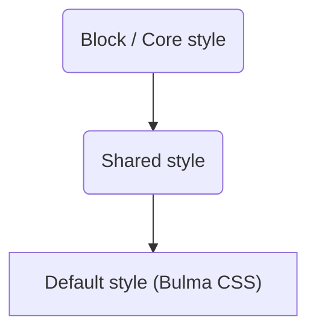

# Custom CSS

Custom styling is supported using a hierarchical model by allowing developers to upload CSS which
gets injected during the runtime of an application.

## Table of Contents

- [Hierarchy](#hierarchy)
- [Applying themes for an application](#applying-themes-for-an-application)
- [Applying themes to specific blocks or pages](#applying-themes-to-specific-blocks-or-pages)
- [Appsemble classes](#appsemble-classes)
- [Using the CLI](#using-the-cli)

## Hierarchy

<span class="is-pulled-right"></span>



**Core** styling gets applied to any part of an Appsemble application not related to a block, such
as the navigation bar, side menu, login view, message toasts, etc. The styling applied to the core
modules _do not_ get applied to blocks.

**Block** styling gets applied to a specific block.

**Shared** styling gets applied to each individual block, as well as the Appsemble core. This is
useful for applying styles to elements that can appear in both the core modules and blocks such as
input fields. It can also be used to apply [CSS variables][css-variables].

> **Note**: Block styling can currently only be created by externally uploading the app
> [using the cli](#using-the-cli).

## Applying themes for an application

Open the Appsemble studio located at the base URL of Appsemble. Login and create your first app.
Within the editor, tabs for `shared` and `core` are available. These tabs contain the current
styling for these modules. Tabs containing styling for specific blocks are automatically added and
removed depending on which blocks are used within the app definition.

To preview a style change, simply enter CSS in the corresponding tabs and press the `Publish`
button.

Example shared styling:

```css copy
.input,
.button {
  border-radius: 0;
  box-shadow: 5px 5px #888888;
  font-family: serif;
}
```

Example core styling:

```css copy
.navbar {
  background-color: var(--primary-color) !important;
}

.navbar-item {
  color: var(--primary-color-invert) !important;
  padding: 0 !important;
}
```

Example block styling for `@appsemble/form`:

```css copy
form {
  max-width: initial !important;
  padding: 0 !important;
}

.field.is-horizontal {
  box-sizing: border-box;
  max-width: 100vw;
  padding: 0.5em 1em;
}
```

## Applying themes to specific blocks or pages

Specific pages and elements can be styled in the core styling by using the `data-` attributes that
are applied to pages. Each page has a `data-path` and a `data-path-index` attribute. The `data-path`
is a unique path calculated using Appsemble’s normalization function that represents a page or a
block. For example, it could be `data-path="pages.example-page"`. `data-path-index` is the same,
except it uses the index of the page. For example, `data-path-index="pages.0"`.

To target this using CSS:

```css copy
[data-path='pages.example-page'] {
  background-color: red;
}
```

The blocks within a page also have their own data properties applied to them. These are `data-path`,
`data-path-index` and `data-block`. The property `data-path` looks similar to `data-path` on pages
with `.blocks.` being added followed by the index number of the block such as:
`pages.example-page.blocks.1` for the second block on the first page. The `data-path-index` property
is the same as `data-path` using the index of the page instead of the page’s internal name. The
`data-block` property contains the full name of the block. Both of these can be combined to target
specific blocks on specific pages.

```css copy
/* List blocks have a yellow background. */
[data-block='@appsemble/list'] {
  background-color: yellow;
}

/* List blocks on the first page have a blue background. */
[data-path-index='pages.0'] [data-block='@appsemble/list'] {
  background-color: blue;
}
```

At the current state Appsemble doesn’t support theming of specific parts of the block elements. As
an example, it is possible to change list block’s background color but changing styling of list
elements wouldn’t be possible. Such approach is currently only supported within the form block due
to inner elements of the form block also generating unique paths by Appsemble’s normalization
function.

Even though direct theming and styling for inner elements of the blocks is not available via the
Appsemble editor it still allows to use CSS combinators, separators and selectors.

```css copy
/* Allows changing background color of the list within the tabs menu */
.tabs > ul {
  background-color: #f8f8f8;
}
```

It also is possible to add block overrides but such functionality is not present through the
Appsemble editor. If the app is being developed via Appsemble CLI index.css file can be created for
every block used within the app and block’s CSS being adjusted directly for this specific app.

## Appsemble classes

In addition to Bulma classes, Appsemble has defined the following classes in the core part of
Appsemble.

| CSS Class               | Context               | Description                             |
| ----------------------- | --------------------- | --------------------------------------- |
| `.bottom-nav`           | Bottom app navigation | The container element.                  |
| `.bottom-nav-item`      | Bottom app navigation | A navigation list item.                 |
| `.bottom-nav-item-link` | Bottom app navigation | A link inside a list item.              |
| `.appsemble-login`      | The login page        | A container element for the login page. |

## Using the CLI

Themes may also be uploaded as part of an app via the CLI. To do this, create a directory named
`theme` inside the app directory. Within the `themes` directory the core style goes into
`core/index.css`, shared style into `shared/index.css` and block styling into
`@<organizationId>/<blockId>/index.css`. An example app theme file structure could look like this:

```
my-app/
├── app-definition.yaml
└── theme/
    ├── @appsemble/
    │   └── form/
    │       └── index.css
    ├── core/
    │   └── index.css
    └── shared/
        └── index.css
```

Themes uploaded using the CLI support CSS modules. This means CSS can be imported using the
following syntax:

```css copy
@import 'other-file.css';
```

To do even more advanced CSS transformations a custom `postcssrc` file can be created. See
[`postcss-load-config`][] for details.

[css-variables]: https://developer.mozilla.org/en-US/docs/Web/CSS/Using_CSS_variables
[`postcss-load-config`]: https://github.com/michael-ciniawsky/postcss-load-config

## Related subjects

- [Styling](../app/styling.md)
- [Theming](theming.md)
