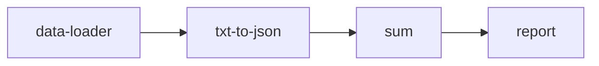

# Events

## Table of Contents

- [Introduction](#introduction)
- [Event action](#event-action)

## Introduction

Events are a mechanism in Appsemble that can be used to make blocks on a page communicate with each
other. Blocks can define which events they support, which then allows app developers to customize
under what name the events will be emitted.

Blocks can either _listen_ to an event and do something with the data it receives, or they can
_emit_ an event which is received by any block listening to an event with the same name.

For example, the `data-loader` block, which is primarily used to load data and pass it to other
blocks, supports both emitting events (the data it loaded), as well as listening for a specific type
of event to refresh its data.

In an app definition this can be defined as follows, taking the `data-loader` block as an example:

```yaml copy validate blocks-snippet
blocks:
  - type: data-loader
    version: 0.34.1-test.3
    actions:
      onLoad: # load some form of data from somewhere
        type: resource.query
        resource: person
    events:
      emit:
        data: people # the data event is emitted when data-loader is finished loading, and will emit it under the name ‘people’
      listen:
        refresh: refreshPeople # any received event using the name ‘refreshPeople’ will trigger a refresh
```

The `data-loader` block will send an event called `people` containing the data it received when it
finishes the `onLoad` action. It also waits for any incoming events under the name of
`refreshPeople`, which upon being received will call `onLoad` again and emit its data once again to
recreate refreshing the data.

This functionality may seem unwieldy at a first glance, but it allows for more powerful and flexible
data management by giving app developers more control of what happens with the data flow.

In order to demonstrate why this is flexible and powerful, let’s consider the following hypothetical
situation:

You have an API from a third party that returns in a specific way that is for one reason or the
other not usable within Appsemble. It may be in the wrong format or its data needs to be processed.

By chaining events it is possible to receive this incorrectly formatted data using `data-loader`,
pass it to a block that processes this data, then finally sends this processed data to another block
that can display it.

For example, using an API that returns a text file containing data in an arbitrary format: Pass it
to a block called `txt-to-json` to convert this data to JSON, then pass it to a block called `sum`
which aggregates the data by adding it, then finally send it to the `report` block to display the
data.



More information about which kinds of events are supported by each block can be found in the
[block's documentation](/blocks).

## Event action

It is possible to emit your own events based on actions triggered from a block. This can be done by
using an [event action](../reference/action.mdx#event).

Any data received from the action will be passed to the event.

For example, let’s say we want an `action-button` to trigger the `data-loader` to refresh its data:

```yaml copy validate blocks-snippet
blocks:
  - type: data-loader
    version: 0.34.1-test.3
    actions:
      onLoad: # load some form of data from somewhere
        type: resource.query
        resource: person
    events:
      emit:
        data: people
      listen:
        refresh: refreshPeople
  - type: action-button
    version: 0.34.1-test.3
    parameters:
      icon: sync
    actions:
      onClick:
        type: event
        event: refreshPeople
  - type: table
    version: 0.34.1-test.3
    events:
      listen:
        data: people
    parameters:
      fields:
        - value: { prop: firstName }
          label: First Name
        - value: { prop: lastName }
          label: Surname
```

> **Note**: The [prop remapper](../remappers/data.mdx#prop) allows you to access the value at the
> given property of the incoming data. In this example, we set the value of the table rows to be
> that of the `firstName` and `lastName` properties.

Triggering the `onClick` action on `action-button` will cause it to emit an event called
`refreshPeople`, which the `data-loader` block is listening for, causing it to refresh its data.

The `data-loader` also emits an event called people, so we need to have a block that will listen for
it - the `table` block.
