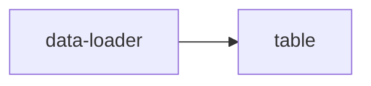

# Events

The blocks that make up an Appsemble app pass data between each other using **events**. This makes
it possible to load data using one block, and display that same data in another block like a table.



Chaining blocks like this is key to achieving proper functionality in an app.

## Passing data between blocks

Blocks can **emit** events and **listen** to events. This can either be done using the `event`
property of a block, or by using the [event action](/docs/guides/events#event-action).

To get a good understanding of how this works, read the following:

- [Events](/docs/guides/events#introduction)

## Accessing data

Once the data reaches your block it becomes available inside as the root data. You can access
specific properties of this data by using the `prop` remapper.

Let's say the data you receive looks like this:

```json
{
  "firstName": "Johan",
  "occupation": "Lab assistant"
}
```

You can pick specific properties to use in a block using `prop`. If you want to display this
information in a `detail-viewer` block, it could look like this:

```yaml copy
type: detail-viewer
version: 0.30.14-test.7
events:
  # Define the event that listens for the incoming data
  listen:
    data: personInfo
parameters:
  fields:
    - label: { prop: firstName } # Display the value in the "firstName" property
      value: { prop: occupation } # Display the value in the "occupation" property
```

There's more to how data works in a block, but for the sake of this chapter we will keep it simple.
This will be explained further in the **Data transformation** chapter.
