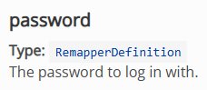

# What are remappers?

The main way to transform data in Appsemble is by using **[remappers](/docs/remappers)**.

A remapper is similar to an action, but with the focus purely on the transformation of existing data
into the form you need it to be.

You can read the following paragraph to learn the basics of how remappers work:

- [Introduction](/docs/remappers#introduction)

## Where can you use remappers?

Remappers can be used in any property that accepts type RemapperDefinition.

An important example of this is the ActionDefinition. Every ActionDefinition has a **remapBefore**
and **remapAfter** property. This allows you to transform the data before or after the action
happens, respectively.

You can see whether a property accepts a remapper or not by checking in their documentation. If it
says "Type: RemapperDefinition" or "Format: Remapper", you can use a remapper.

As an example, these are both properties that accept a remapper:

